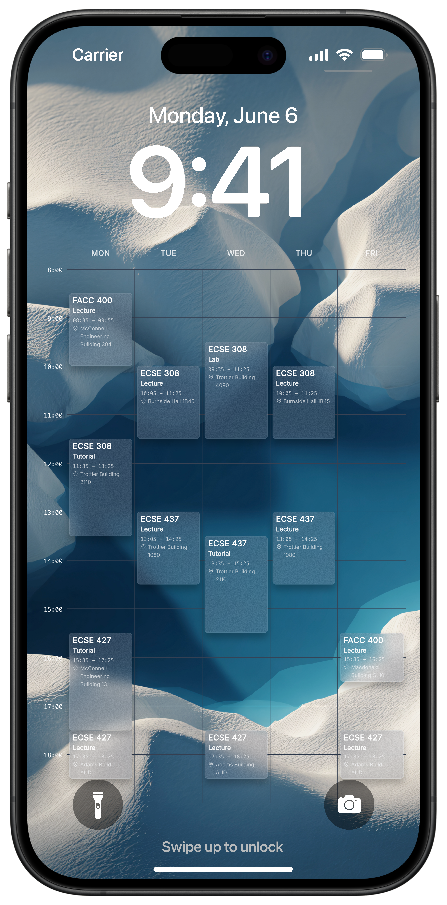

# ScheduleStyler

Transform ugly ahh calendar screenshots into good looking ones. ScheduleStyler.com

## Before & After

<table>
<tr>
<td align="center"><strong>Before</strong></td>
<td align="center"><strong>After</strong></td>
</tr>
<tr>
<td></td>
<td></td>
</tr>
</table>

---

## How It Works

1. **Upload** — Drop in a screenshot of your calendar or enter events manually
2. **Edit** — Review extracted events and fine-tune details
3. **Export** — Pick a style and download your schedule in high resolution

---

## Tech Stack

- **Frontend** — React 19, TypeScript, Vite, Tailwind CSS, Styled Components, Framer Motion
- **Backend** — Express, TypeScript (Vercel serverless in production)
- **AI** — Google Gemini 2.0 Flash (image-to-schedule extraction)

---

## Getting Started

### Prerequisites

- Node.js v18+
- A [Google Gemini API key](https://aistudio.google.com/apikey)

### Setup

```bash
# Install dependencies
npm install

# Create your env file
echo "GEMINI_API_KEY=your_key_here" > .env.local

# Start the dev server (client on :3000, server on :3001)
npm run dev
```

The app uses **BYOK (Bring Your Own Key)** mode — paste your Gemini API key in the UI and all image extraction runs against your own key. No other services are required for local development.

---

## Project Structure

```
├── api/              # Vercel serverless functions (also used locally via Express adapter)
│   ├── extract/      # Gemini-powered schedule extraction
│   ├── backgrounds/  # Background image serving (Cloudflare R2)
│   └── webhooks/     # GitHub star webhook
├── components/       # React components (UploadStep, EditStep, ExportStep, etc.)
├── services/         # Gemini API client
├── server/           # Express dev server + Vercel adapter
├── contexts/         # React contexts (backgrounds, examples)
└── assets/           # Static assets and example images
```

---

## Deployment

Deployed on **Vercel**. The `/api` directory maps directly to serverless functions. Run `vercel` or push to your connected repo to deploy.

---

## License

MIT
