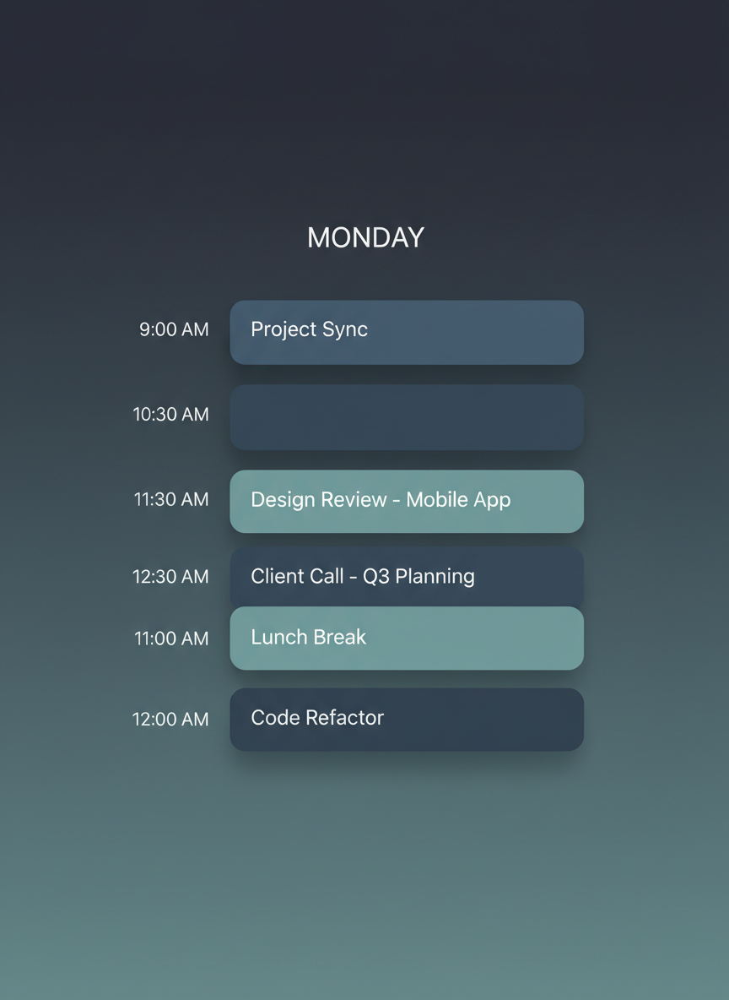

# ScheduleStyler

Transform ugly ahh calendar screenshots into good looking Ones.

## Before & After

<table>
<tr>
<td align="center"><strong>Before</strong></td>
<td align="center"><strong>After</strong></td>
</tr>
<tr>
<td></td>
<td></td>
</tr>
</table>
<!-- 
<p align="center">
  
</p> -->

---

## How It Works

1. **Upload** - Drop in a screenshot of your calendar/Manual Input
2. **Edit** - Review extracted events and fine tune details
3. **Export** - Select Styling and download your fire schedule thats ready to plug and play. (High resolution)
---

### Prerequisites

- Node.js (v18+)
- A [Google AI Studio](https://aistudio.google.com/) API key

### Installation

```bash

# Install dependencies
npm install

# Set your Gemini API key
echo "GEMINI_API_KEY=your_api_key_here" > .env.local

# Start the development server
npm run dev
```

Open localhost in your browser.

---

## License

MIT
